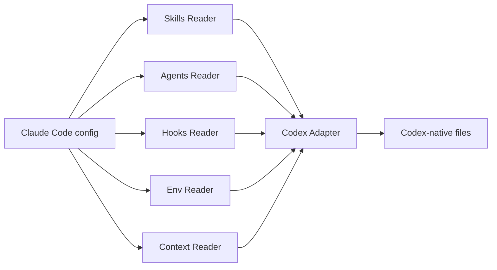

# cc-bridge

[](LICENSE)
[](pyproject.toml)
[](tests/)

## What it does

cc-bridge performs deterministic translation of Claude Code configuration into Codex CLI format. It covers skills, agents, hooks, env vars, context files, and rules. No LLM sits in the translation loop — the pipeline is pure Python over declarative YAML mappings.

## Architecture



## What gets translated

| Config Type   | Claude Code Source               | Codex Output                     |
|---------------|----------------------------------|----------------------------------|
| Skills        | `.claude/skills/*/SKILL.md`      | `.agents/skills/*.md`            |
| Agents        | `.claude/agents/*.md`            | `.codex/agents/*.toml`           |
| Hooks         | `settings.json` → `hooks`        | `.codex/hooks.json`              |
| Env vars      | `settings.json` → `env`          | `.codex/env-bridge.toml`         |
| Context files | `CLAUDE.md`, `CLAUDE.local.md`   | `AGENTS.md`, `AGENTS.override.md`|
| Rules         | `.claude/rules/*.md`             | `AGENTS.md` (scoped → nested)    |

## Installation

```bash
claude plugin add m-ghalib/cc-bridge
```

## Usage

### Sync
Trigger phrase: **"sync to codex"** — translates Claude Code config and writes Codex files to disk.

### Diff
Trigger phrase: **"bridge diff"** — previews the changes a sync would make without writing anything.

### Status
Trigger phrase: **"sync status"** — reports drift between Claude Code config and the current Codex output.

## Gap handling

Features without a Codex equivalent produce warnings, not errors — sync continues and reports what was skipped. See [`docs/specs/platform-feature-mapping.md`](docs/specs/platform-feature-mapping.md) for the full comparison matrix.

## Development

Run the test suite:

```bash
uv run pytest
```

Full design spec: [`docs/specs/2026-04-22-cc-bridge-design.md`](docs/specs/2026-04-22-cc-bridge-design.md).

## License

MIT — see [LICENSE](LICENSE).
