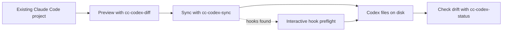
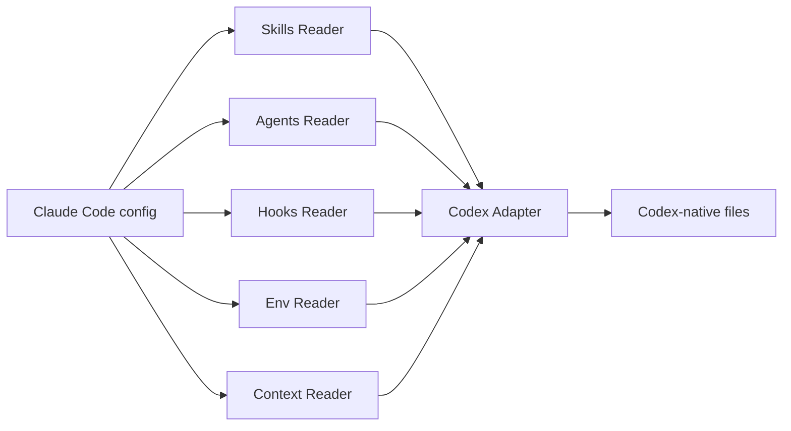

# cc-codex-bridge


[](LICENSE)
[](plugins/cc-codex-bridge/package.json)
[](plugins/cc-codex-bridge/tests/)

Sync an existing Claude Code project into Codex-native config. The bridge is a
deterministic Node 20 translator: no LLM rewrite, no new `.claude/` bootstrap,
and no hidden hook enablement.

## Installation

```text
/plugin marketplace add m-ghalib/cc-codex-bridge
/plugin install cc-codex-bridge@cc-codex-bridge
```

## Quick start

| Goal | Use this | Result |
|------|----------|--------|
| Preview changes | `cc-codex-diff` | Unified diff only; no files written |
| Sync config | `cc-codex-sync` | Writes Codex files and runs hook preflight when needed |
| Check drift | `cc-codex-status` | Reports missing, stale, or orphaned Codex output |

## Translation map

| Claude Code input | Codex output | Notes |
|-------------------|--------------|-------|
| `CLAUDE.md` | `AGENTS.md` | Main project instructions |
| `CLAUDE.local.md` | `AGENTS.override.md` | Local override file |
| `.claude/skills/*/SKILL.md` | `.codex/skills/*/SKILL.md` | Skill content plus companion files |
| `.claude/agents/*.md` | `.codex/agents/*.toml` | Agent frontmatter/body becomes Codex TOML |
| `.claude/rules/*.md` | `AGENTS.md` files | Scoped rules become nested Codex instructions |
| `.claude/settings.json` (`env`) | `.codex/env-bridge.toml` | Merge into active Codex `config.toml` before use |
| `.claude/settings.local.json` (`env`) | `.codex/env-bridge.toml` | Local env wins where Claude Code would merge it |
| `.claude/settings.json` (`hooks`) | `.codex/hooks.json` | Interactive preflight required before write |

## What it does

`cc-codex-bridge` is a Claude Code plugin plus a packaged CLI for moving
Claude Code configuration into Codex CLI-native files. v1 targets Codex only.
It translates skills, agents, hooks, env vars, context files, and rules.



When Codex has no equivalent for a Claude Code feature, sync continues and
reports the skipped item plus the manual follow-up.

## Prerequisites

| Requirement | Why it matters |
|-------------|----------------|
| Claude Code installed and authenticated | Plugin install and skill execution happen inside Claude Code |
| Node 20 LTS or newer on `PATH` | Shipped skills call `node ${CLAUDE_PLUGIN_ROOT}/dist/cli.js ...` |
| Existing Claude Code config | The bridge translates existing files; it does not create a starter `.claude/` tree |
| Codex CLI | Needed only when you want to use the generated `.codex/...` output locally |

## Architecture



## Repo layout

- `plugins/cc-codex-bridge/` — TypeScript package, plugin manifest, skills, tests, and docs
- `plugins/cc-codex-bridge/src/cli.ts` — entrypoint for `sync`, `diff`, and `status`
- `plugins/cc-codex-bridge/dist/` — compiled Node 20 runtime used by installed skills
- `plugins/cc-codex-bridge/docs/specs/` — bridge design docs and feature mapping
- `plugins/cc-codex-bridge/docs/platform-snapshots/` — refreshed upstream Claude Code and Codex docs
- `.github/workflows/` — PR checks, Claude automation, CodeQL, and doc refresh

## Usage

The plugin exposes three skills. Invoke them directly in Claude Code with the
plugin namespace, for example `/cc-codex-bridge:cc-codex-sync`.

- `cc-codex-sync` — translate and write Codex output files
- `cc-codex-diff` — preview the unified diff without writing files
- `cc-codex-status` — report drift, missing outputs, and orphaned Codex files

Equivalent commands from `plugins/cc-codex-bridge/` once installed:

```bash
node dist/cli.js sync --target codex --project-root /path/to/project
node dist/cli.js diff --target codex --project-root /path/to/project
node dist/cli.js status --target codex --project-root /path/to/project
node dist/cli.js hooks-inventory --target codex --project-root /path/to/project
```

Hook translation is interactive-only. The bridge no longer accepts a coarse
`--include-user-hooks` flag — instead, run the
`/cc-codex-bridge:cc-codex-sync` skill which walks you through scope,
per-entry selection, write mode, and Codex hook enablement before any
`.codex/hooks.json` write happens.

## Activation Notes

- Plain `sync` skips hook translation and emits a `hook preflight required`
  warning when Claude Code hook entries are present. Use
  `/cc-codex-bridge:cc-codex-sync` to translate them.
- The preflight writes `.codex/hooks.json` and (on request) sets
  `[features] codex_hooks = true` in the chosen `config.toml`.
- Env vars are written to `.codex/env-bridge.toml` and do not apply until that
  fragment is merged into an active Codex `config.toml`.

## Gap handling

Features without a Codex equivalent produce warnings, not errors. Sync keeps
going and reports what was skipped plus any manual follow-up. See
[`plugins/cc-codex-bridge/docs/specs/platform-feature-mapping.md`](plugins/cc-codex-bridge/docs/specs/platform-feature-mapping.md)
for the comparison matrix.

## Development

Install dev dependencies and run the test suite from the plugin directory:

```bash
cd plugins/cc-codex-bridge
bun install
bun test
```

Build the dist bundle consumed by installed skills:

```bash
cd plugins/cc-codex-bridge
bun run build
```

Refresh the upstream doc snapshots with:

```bash
cd plugins/cc-codex-bridge
bun run refresh-cli-docs
```

If you want the GitHub review/orchestrator workflows in this repo to run, set
these repository secrets first:

- `CLAUDE_CODE_OAUTH_TOKEN`
- `CLAUDE_BOT_PAT`

Core docs:

- [`plugins/cc-codex-bridge/docs/specs/2026-04-22-cc-bridge-design.md`](plugins/cc-codex-bridge/docs/specs/2026-04-22-cc-bridge-design.md)
- [`plugins/cc-codex-bridge/docs/specs/platform-feature-mapping.md`](plugins/cc-codex-bridge/docs/specs/platform-feature-mapping.md)
- [`docs/superpowers/specs/2026-04-23-cc-bridge-node20-migration-design.md`](docs/superpowers/specs/2026-04-23-cc-bridge-node20-migration-design.md)

## License

MIT. See [LICENSE](LICENSE).
