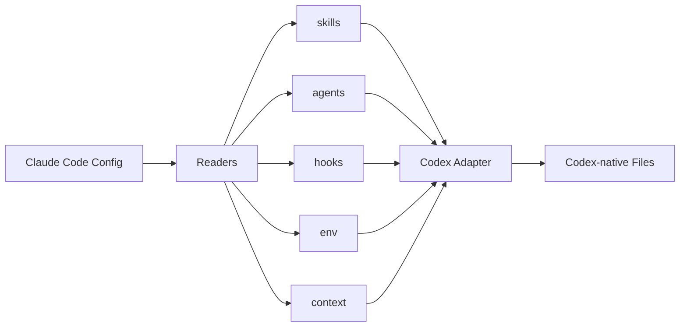

# cc-bridge Public Release Prep — Design Spec

**Date:** 2026-04-23
**Author:** m-ghalib
**Status:** Approved

## Goal

Prepare cc-bridge for public sharing (GitHub, HN, LinkedIn) by adding the
missing developer-facing files and fixing stale references. No feature work.

## Audience

Claude Code power users who also use Codex CLI. Assumes familiarity with both
tools. Minimal hand-holding.

## Deliverables

### 1. README.md (new file, ~80-100 lines)

Structure, top to bottom:

| Section | Content | Lines |
|---|---|---|
| Title + badges | `# cc-bridge` with MIT license badge, Python >=3.13, tests passing | 3 |
| What it does | 2-3 sentences: deterministic translation, no LLM, 6 config types | 3 |
| Architecture | Mermaid flowchart: Claude Code config → 5 Readers → Codex Adapter → Output | 15 |
| What gets translated | 3-column table: Config Type / Claude Code Source / Codex Output (6 rows) | 12 |
| Installation | `claude plugin add` pointing to GitHub repo | 4 |
| Usage | 3 code blocks for sync, diff, status skills | 15 |
| Gap handling | Unsupported features produce warnings. Link to platform-feature-mapping.md | 4 |
| Development | `uv run pytest` to run tests. Link to design spec | 4 |
| License | MIT — link to LICENSE | 2 |

Tone: terse, scannable. No tutorial prose. Power users scan tables and diagrams.

### 2. LICENSE (new file)

MIT license. Copyright line: `Copyright (c) 2026 m-ghalib`

### 3. plugin.json enrichment (modify existing)

Add fields to `.claude-plugin/plugin.json`:

```json
{
  "author": "m-ghalib",
  "license": "MIT",
  "homepage": "https://github.com/m-ghalib/cc-bridge",
  "repository": "https://github.com/m-ghalib/cc-bridge",
  "keywords": ["codex", "bridge", "config", "translation", "sync"]
}
```

### 4. Fix stale GitHub URL

**File:** `scripts/refresh_cli_docs.py` line 27
**Change:** `github.com/mominabrarghalib/cc-bridge` → `github.com/m-ghalib/cc-bridge`

### 5. Fix stale directory paths in design spec

**File:** `docs/specs/2026-04-22-cc-bridge-design.md` lines 46-49
**Change:** Update plugin structure diagram from `skills/cc-bridge/sync/SKILL.md`
(nested) to `skills/sync/SKILL.md` (flattened), matching the actual repo
structure after PR #2.

## Out of scope

- CONTRIBUTING.md
- CHANGELOG.md
- New features or config translations
- Blog post or announcement copy
- pyproject.toml metadata enrichment (already has name/version/description)

## Mermaid diagram for README



## Translation table for README

| Config Type | Claude Code Source | Codex Output |
|---|---|---|
| Skills | `.claude/skills/*/SKILL.md` | `.agents/skills/*.md` |
| Agents | `.claude/agents/*.md` | `.agents/skills/*.md` (TOML frontmatter) |
| Hooks | `settings.json` → `hooks` | `.codex/config.toml` `[hooks]` |
| Env vars | `settings.json` → `env` | `.codex/config.toml` `[shell_environment_policy]` |
| Context files | `CLAUDE.md`, rules | `AGENTS.md`, nested `AGENTS.md` |
| Rules | `.claude/rules/*.md` | `AGENTS.md` or nested `AGENTS.md` (scoped) |
